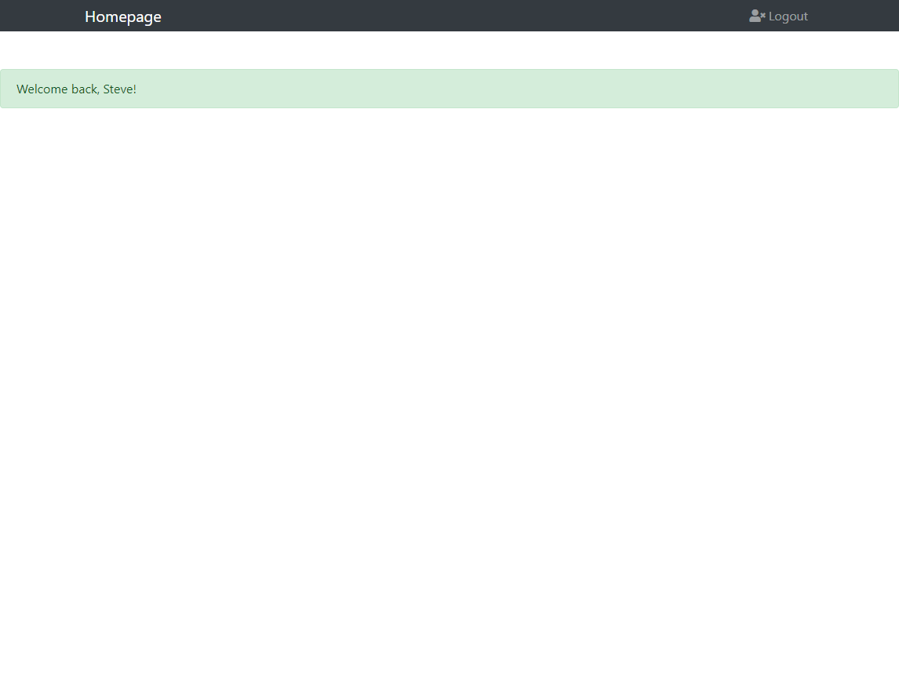
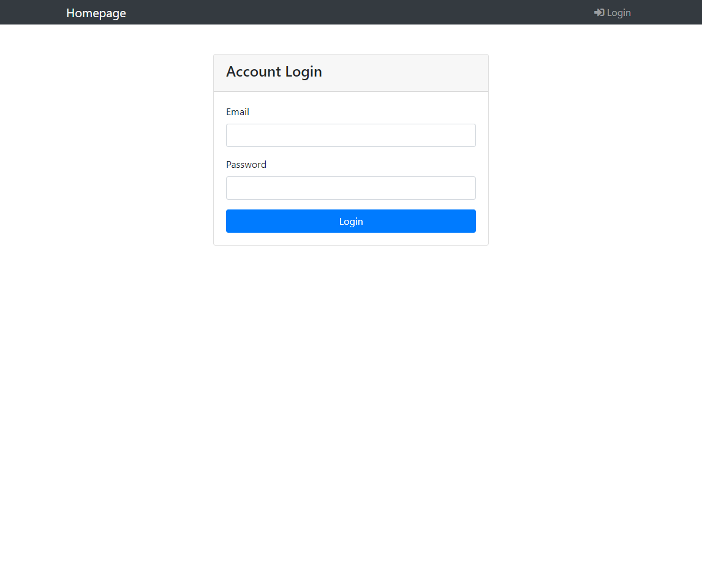

# Login page

This is a **Login page** demo which built up from [Alphacamp](https://tw.alphacamp.co/) semester 3 assignment.






## Installing

### Git bash

#### git clone

`git clone` to clone the project

```markdown
git clone https://github.com/mpragnarok/login-page.git
```

### Command line

#### npm install

Install all the packages in the project.

#### npm run dev

Start the server with **nodemon** command.

#### npm run start

Start the server with node command.

#### CTRL + C twice

Stop the server

### Browser

Head to [http://localhost:3000](http://localhost:3000) to experience the login page demo.

## Feature

​	Login page can remember what user have been in put in email field, and react when email address or password is not correct . 

Front-end part is written in **JavaScript**, **bootstrap** and **HTML**, back-end part is written in **Node.js** and **Express.js**.

## packages

#### dependencies

1. express
2. express-handlebars
3. body-parser

#### devDependency

1. nodemon